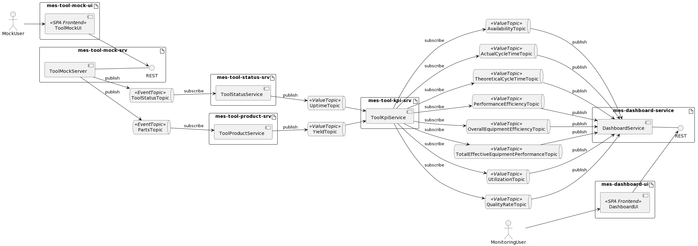

# mes-tool-mock-ui

A web app to provide a UI for the [mes-tool-mock-srv](https://github.com/onouv/mes-tool-mock-srv.git)

This UI calls REST endpoints of the [mes-tool-mock-srv](https://github.com/onouv/mes-tool-mock-srv.git) to operate a virtual tool (i.e. a machine producing parts) to support testing and development of the mes data system.

## Fit in Overall Architecture 

